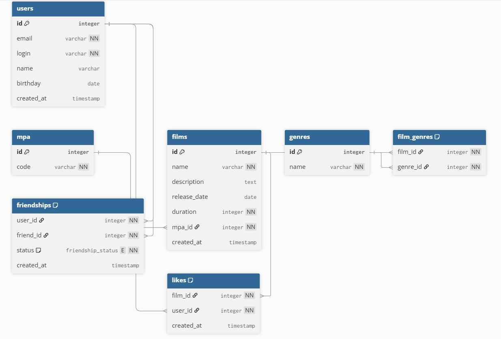

# java-filmorate
## ER-диаграмма

- **users** — пользователи.
- **mpa** — рейтинги MPA (G, PG, PG_13, R, NC_17).
- **films** — фильмы, один `mpa_id` на фильм.
- **genres** — жанры.
- **film_genres** — связь фильмов и жанров.
- **friendships** — «дружба» между пользователями со статусом `pending/confirmed`.
- **likes** — лайки фильмов пользователями.



### Примеры запросов

- Все фильмы с кодом рейтинга:
  ```sql
  SELECT f.id,
         f.name,
         m.code
  FROM films AS f
  JOIN mpa AS m ON m.id = f.mpa_id;
  ```

- 10 популярных фильмов по лайкам:
  ```sql
  SELECT f.id,
         f.name,
         COUNT(l.user_id) AS likes
  FROM films AS f
  LEFT JOIN likes AS l ON l.film_id = f.id
  GROUP BY f.id,
           f.name
  ORDER BY likes DESC
  LIMIT 10;  
  ```